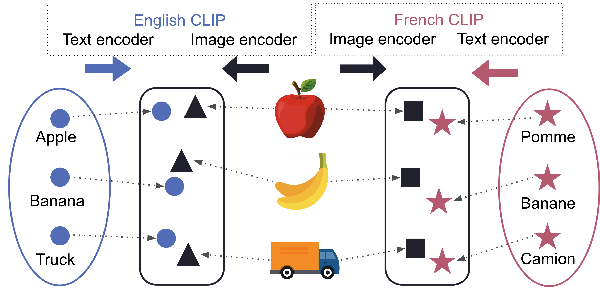
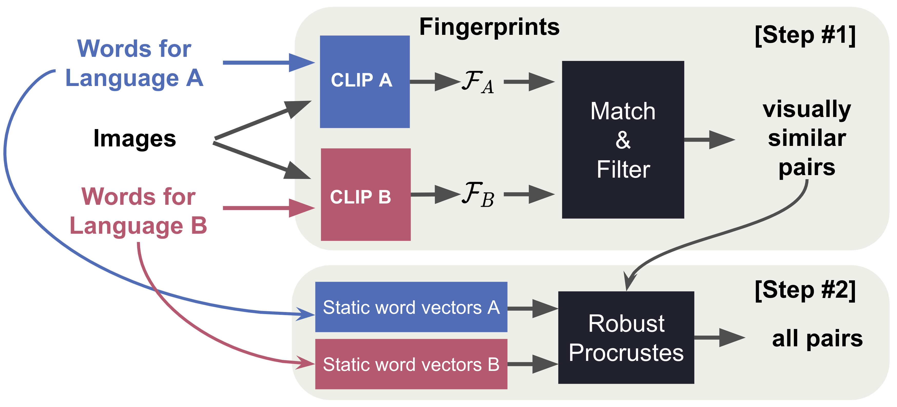

# Utilizing Language-Image Pretraining for Efficient and Robust Bilingual Word Alignment
[Tuan Dinh](https://tuan-dinh.github.io/), Jy-yong Sohn, Shashank Rajput, Timothy Ossowski, Yifei Ming, Junjie Hu, Dimitris Papailiopoulos, Kangwook Lee

This repository is the code implementation of paper *[Utilizing Language-Image Pretraining for Efficient and Robust Bilingual Word Alignment](https://arxiv.org/abs/2205.11616)* (appears in the Findings of EMNLP 2022).

## Abstract
Word translation without parallel corpora has become feasible, rivaling the performance of supervised methods. Recent findings have shown the improvement in accuracy and robustness of unsupervised word translation (UWT) by utilizing visual observations, which are universal representations across languages. Our work investigates the potential of using not only visual observations but also pretrained language-image models for enabling a more efficient and robust UWT. We develop a novel UWT method dubbed Word Alignment using Language-Image Pretraining (WALIP), leveraging visual observations via the shared image-text embedding space of CLIPs (Radford et al., 2021). WALIP has a two-step procedure. First, we retrieve word pairs with high confidences of similarity, computed using our proposed image-based fingerprints, which define the initial pivot for the alignment. Second, we apply our robust Procrustes algorithm to estimate the linear mapping between two embedding spaces, which iteratively corrects and refines the estimated alignment. Our extensive experiments show that WALIP improves upon the state-of-the-art performance of bilingual word alignment for a few language pairs across different word embeddings and displays great robustness to the dissimilarity of language pairs or training corpora for two word embeddings. 

<!-- 
<p align="center">
  <br>
</p> -->

<p align="center">
  
  <b>The high-level illustration of WALIP (Word Alignment with Language-Image Pretraining)</b>
    <br>
  
  <b>The two-step procedure of WALIP</b>
</p>


<!-- 
<p style="text-align: center;">The two-step procedure of WALIP</p> -->


## Instructions for running the experiments
---
### Setting up an environment

From a fresh anaconda environment, we recommend first installing the latest stable version of pytorch. Instructions are available on their [website](https://pytorch.org/get-started/locally/) which might differ for different operating systems. For example, on a linux computer, the following should work:

```
conda install pytorch torchvision torchaudio cudatoolkit=11.3 -c pytorch
```

After installing pytorch, you may install the requirements using the requirements.txt file:

```
pip install -r requirements.txt
```

---
### Providing a test dictionary
To run the code, you must download or provide the dictionary you want to evaluate on. We provide some examples in the [dicts/texts/wiki](dicts/texts/wiki) folder. The test dictionaries were obtained [here](https://github.com/facebookresearch/MUSE#ground-truth-bilingual-dictionaries), which also contains over 110 other bilingual ground truth dictionaries. To prepare the dictionary for evaluation:

* Download the dictionary and place it in the [dicts/texts/wiki](dicts/texts/wiki) folder
* Rename the downloaded dictionary to the format orig_wiki_{src_language}_{tgt_language}_test.txt, replacing the {} with source and target language abbreviations. For example, for the english to french dictionary, it should be named orig_wiki_en_fr_test.txt
* Run the [preprocess.py script](dicts/texts/wiki/preprocess.py) script in the dicts/texts/wiki folder:
```
python preprocess.py <src_lang> <tgt_lang>
```

---
### Fasttext and HTW embeddings
Fasttext embeddings can be downloaded as follows:
```
# English fastText Wikipedia embeddings
curl -Lo wiki.en.vec https://dl.fbaipublicfiles.com/fasttext/vectors-wiki/wiki.en.vec
# French fastText Wikipedia embeddings
curl -Lo wiki.fr.vec https://dl.fbaipublicfiles.com/fasttext/vectors-wiki/wiki.fr.vec
```

HTW word2vec files can be downloaded from [here](https://github.com/gsig/visual-grounding/tree/master/word_vectors)

To prepare fasttext or htw embeddings, you can put them in the datasets/wiki folder for fasttext, and the datasets/htw folder for htw. You can then rename the file to match the convention {data}.{lang}.vec, where data is either "wiki" or "htw" and "lang" is the language abbreviation.

---
### Download the image data
To download the imagenet data, start by downloading the [ILSVRC2012_img_val.tar](https://image-net.org/challenges/LSVRC/2012/2012-downloads.php) (about 6.3 GB) from their website, and place it in the datasets/imagenet folder. You may then run these commands in a shell (in the datasets/imagenet folder) to convert it to the ImageFolder format pytorch expects:
```
mkdir val && mv ILSVRC2012_img_val.tar val/ && cd val && tar -xvf ILSVRC2012_img_val.tar
wget -qO- https://raw.githubusercontent.com/soumith/imagenetloader.torch/master/valprep.sh | bash
``` 
---
### Obtain CLIP models for source and target languages

We have a [finetuning](src/finetune_clip.py) script to finetune CLIP models, although there are many publicly available clip models we use as well for 

* [English](https://github.com/openai/CLIP)
* [Russian](https://github.com/ai-forever/ru-clip)
* [Japanese](https://github.com/rinnakk/japanese-clip)
* [Korean](https://github.com/jaketae/koclip)

You can follow instructions on their github to run the pip install command, and install relevant files (if any) in the src/models folder.

To use your own finetuned CLIP model, put the checkpoint into the results/clips folder with the name best_{lang}.pt where lang is the language abbreviation. 

---
### Running Scripts
To run translation and evaluation, you can use the [run_translation](src/scripts/run_translation.sh) script. Ensure all the configuration settings match. In particular:
* configs/cuwt.json: configs for different working modes
* configs/langs.json: configs for each language
* configs/settings.json: generic configs

Then you can run in the src folder:

```
./scripts/run_translation.sh <src_lang> <tgt_lang>
```
The best recall@1 and recall@10 will be printed at the end, and the best mapping will be saved into the results/mapping/ours folder.
The learned mappings from our runs can be found in this folder.

### Credits

We make use of the following repositories to help in our experiments: [MUSE](https://github.com/facebookresearch/MUSE), [Visual Grounding in Video](https://github.com/gsig/visual-grounding), [OpenAI CLIP](https://github.com/openai/CLIP), [Russian CLIP](https://github.com/ai-forever/ru-clip), [Japanese CLIP](https://github.com/rinnakk/japanese-clip) and [Korean CLIP](https://github.com/jaketae/koclip)